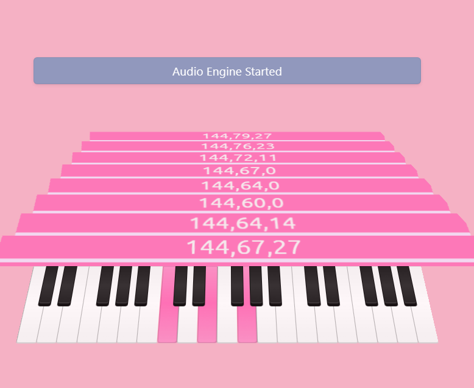

# Web Synth
 A web app simple synthesizer built based on Webmidi and webaudio APIs.  
It is adapted from this [article](https://medium.com/hackernoon/how-to-build-a-collaborative-midi-app-with-express-js-socket-io-273663b63201)  

See live version [here](https://ebony-carpal-area.glitch.me/)

Screenshot below

